SantaGAN
==========

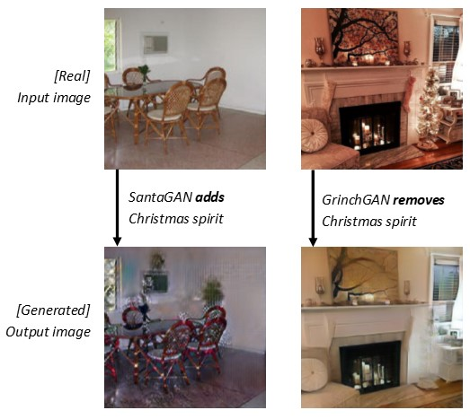

This repository contains some data collection tools and [limited] documentation concerning the application of [CycleGAN](https://junyanz.github.io/CycleGAN/) to a dataset of Christmas-related images.

The intent is to train two generative adversarial networks -- referred to as the GrinchGAN and SantaGAN components -- that transform Christmas-related images to non-Christmas related images, and vice versa, regularized by a cyclic consistency loss. (That is, that an image transformed by Grinch and then Santa, or Santa and then Grinch, should be similar to the original image.) Perhaps such networks could be said to contain the Spirit of Christmas :).

Results
------
We collected a dataset, using tools in this repo, of many indoor and outdoor Christmas-related images, as well as similar non-Christmas images. Three instances of CycleGAN were trained: one with the entire dataset, one for just the indoor images, and one for just the outdoor images (to try to improve performance by focusing on a less diverse range of image content). In general, the Grinch generative network performed qualitiatively better on all datasets, and had more convincing results on the restricted-domain datasets. The Santa generative network appeared to do better on the combined dataset. (I don't have quantitative results to back these up right now, however. The loss didn't appear significantly difference between two GANs.)

Some selected Grinch generator results on indoor dataset (top row is original image, bottom row is Grinchified-image):
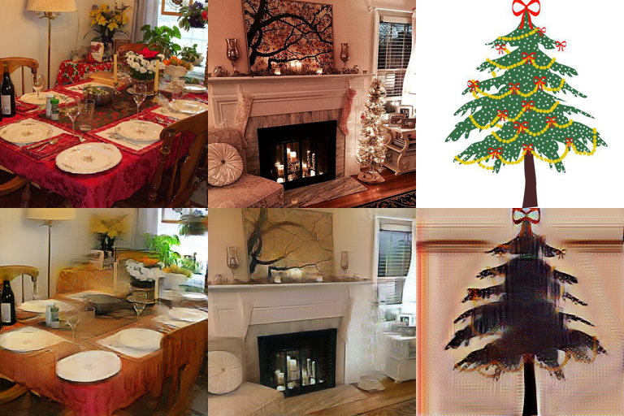

And on the outdoor dataset:
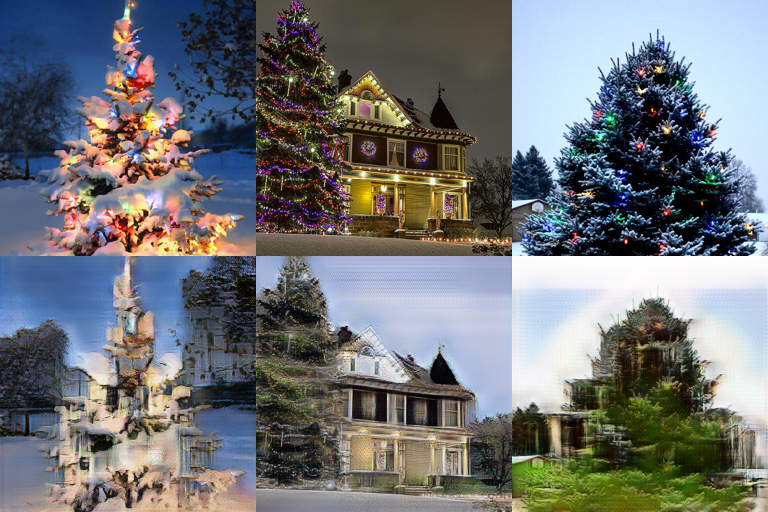

And some selected Santa generator results on the combined datasets:
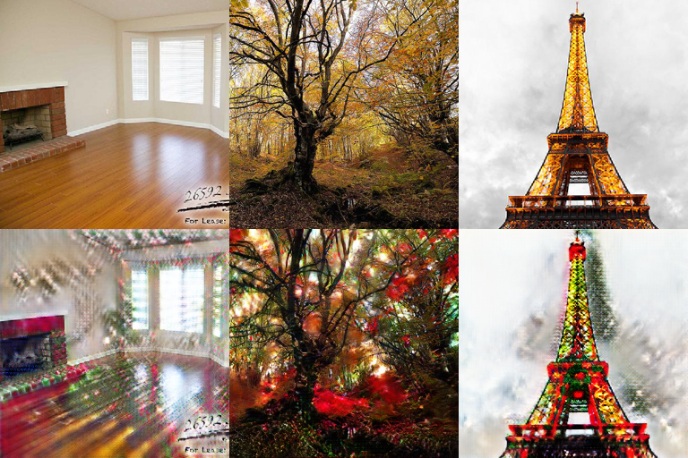
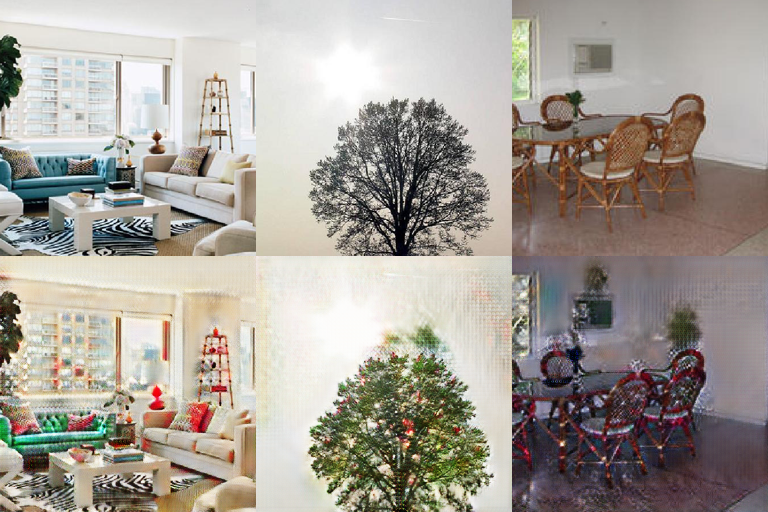

10 random selections from the Christmas domain of the combined dataset:
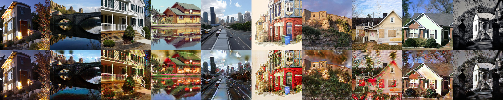

10 random selections from the Christmas domain of the indoor dataset:
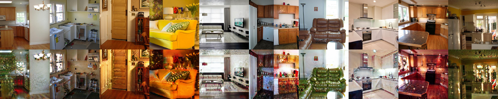

10 random selections from the Christmas domain of the outdoor dataset:
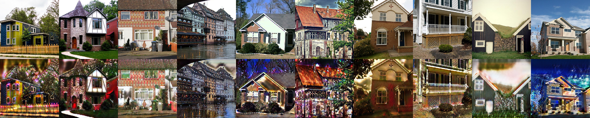

10 random selections from the Grinch domain of the combined dataset:
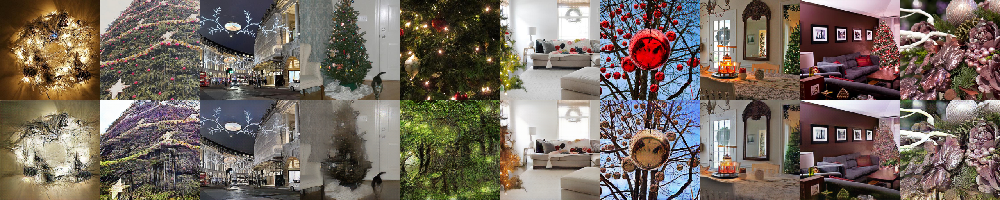

10 random selections from the Grinch domain of the indoor dataset:
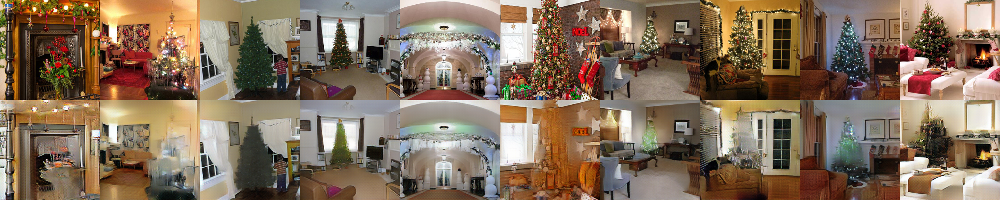

10 random selections from the Grinch domain of the outdoor dataset:
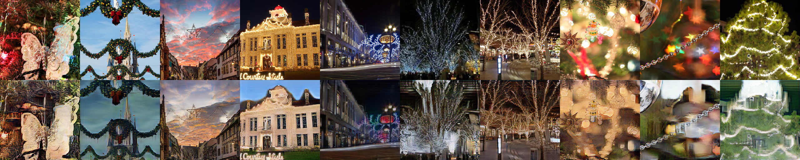


Details
-------
The input set for the Christmas class contains diverse Christmas-related images from Flickr and Google results concerning Christmas trees and Christmas decorations (indoor and outdoor). It contains 632 images total. The indoor decorations example subset has 216 examples, and an outdoor decorations example subset has 149 examples.
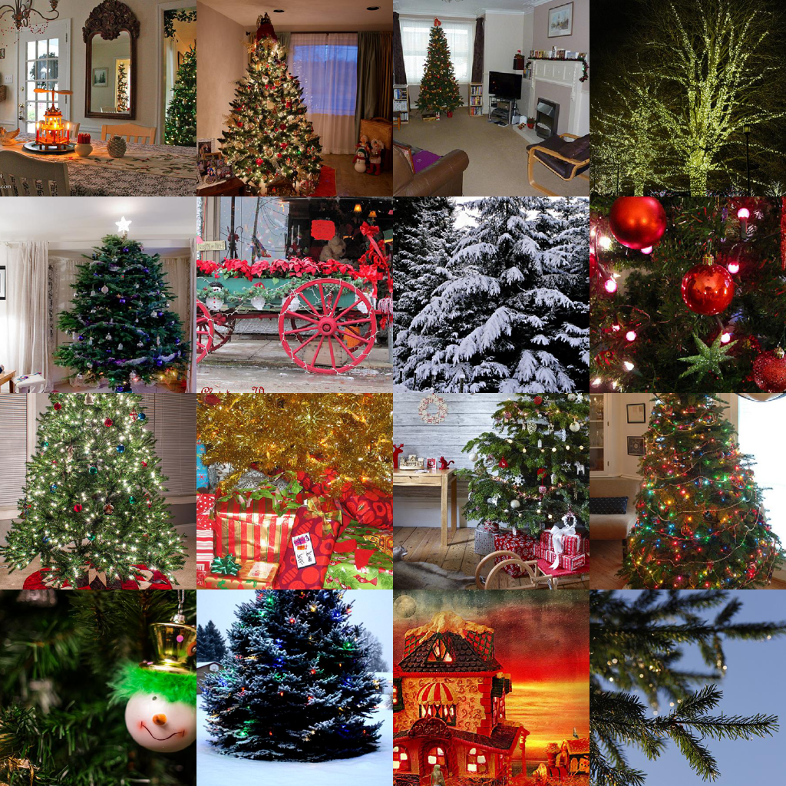

The input set for the non-Christmas class contains diverse indoor scenes as well as outdoor architectural and natural scenes (focused on trees). It contains 642 images total. The indoor decorations example subset has 170 examples, and an outdoor decorations example subset has 277 examples.
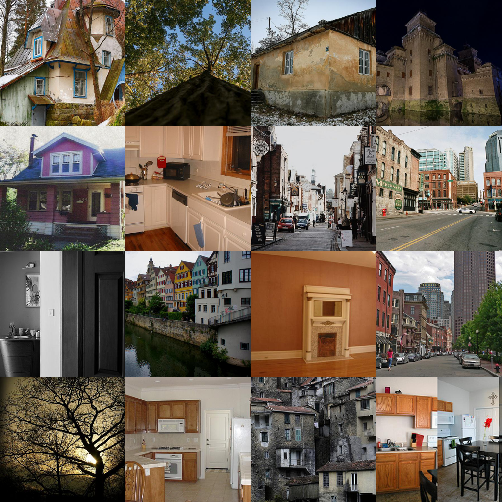

I used the default parameters and configuration and setup in [this PyTorch implementation](https://github.com/junyanz/pytorch-CycleGAN-and-pix2pix)). I did one training run per dataset (so a single run to 200 epochs). All images and results shown here are *in sample* (boo hiss).

Prereqs:
-------

The python scripts should work on both Python 2 and 3 with fairly minimal requirements satisfiable through pip:
```pip install flickrapi image```

See headers of the scripts for info about what they do. Generally, they're all simple utility scripts for either scraping images from Flickr or Google, or they're utilities for assembling those pictures into datasets to feed into CycleGAN (I use [this PyTorch implementation](https://github.com/junyanz/pytorch-CycleGAN-and-pix2pix)), or they're utilities for generating pretty grid images of the results.